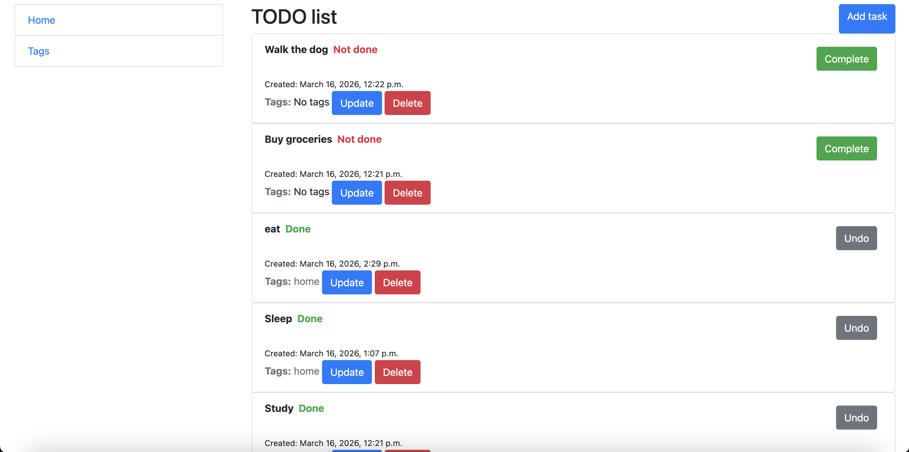

<<<<<<< HEAD
# todo-list
Simple todo list django app
=======
# TODO list

Simple todo app to keep track of daily things

## Installing

Python3.12 must be already installed

```shell
git clone https://github.com/dmitriy-kds/todo-list
cd todo_list
python3 -m venv venv
source venv/bin/activate
pip install -r requirements.txt
python manage.py migrate
python manage.py runserver
```

## Features

* Manage daily tasks, set deadlines and mark tasks as complete
* Tags to better keep track of things to do
* Admin panel for advanced app managing

## Demo


>>>>>>> a3d88bf (chore: Add README.md and todo_demo.png)
